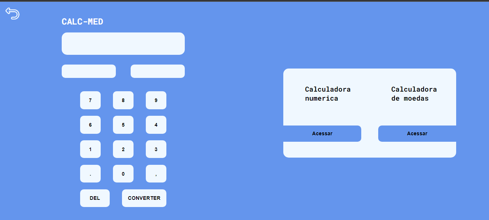

<section class="box-nt" style="display: flex; justify-content: center;">
    
</section>

---

<h1 align="center">CalcPlus</h1>

CalcPlus is a web application aimed at solving 3 types of calculations: Simple numerical calculations, currency exchange and measurement conversion.

---

<h2 align="center">Design</h2>

---

<h2  align="center">Application demo</h2>

---

<h2  align="center">Project</h2>

---

<h2  align="center">Technologies</h2>

---

<h3 align="center">Funcionalidades</h3>

- [] Funcionalidade do visor
- [] Funcionalidades das calculadoras
- [] Responsividade

---

<h3 align="center">Status</h3>

    🚧 Em desenvolvimento... 🚧

